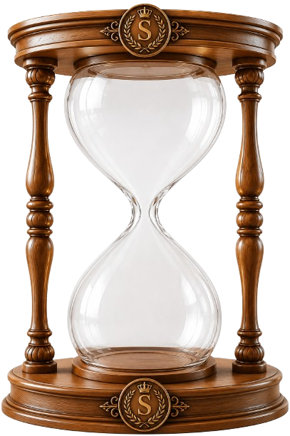

# ⏳ Hourglass

A realistic, animated hourglass **web component** — drop it into any website with a single `<script>` tag. No build step, no npm install, no framework required. It works the same in plain HTML, React, Vue, Angular, Svelte, WordPress, Webflow, Shopify — anywhere HTML runs.

**[Live demo](https://govindmehta15.github.io/Hourglass/)**



## Why it works everywhere

`hourglass.js` registers a native [Custom Element](https://developer.mozilla.org/en-US/docs/Web/API/Web_components/Using_custom_elements), `<hour-glass>`, using only standard browser APIs (Shadow DOM, Canvas, `customElements.define`). All artwork is base64-inlined inside the single JS file — there are no separate image requests, no CSS files, and zero dependencies. Once the tag is defined, `<hour-glass>` behaves like `<div>` or `` — every framework already knows how to render an HTML element, so it just works.

## Quick start

Add two lines to any page:

```html
<script src="https://cdn.jsdelivr.net/gh/govindmehta15/Hourglass@main/hourglass.js"></script>
<hour-glass duration="12" sand-color="#e6b93d" width="260"></hour-glass>
```

That's it — no install, no config. The script tag can go in `<head>` or right before `</body>`.

> **Pin a version for production.** `@main` always serves the latest commit, which is great for trying it out but can change under you. Once you've tagged a release (e.g. `git tag v1.0.0 && git push --tags`), point production sites at `@v1.0.0` instead of `@main` for a stable, cached URL:
> `https://cdn.jsdelivr.net/gh/govindmehta15/Hourglass@v1.0.0/hourglass.js`

### Alternative hosting URLs

| Source | URL | Notes |
|---|---|---|
| jsDelivr CDN (recommended) | `https://cdn.jsdelivr.net/gh/govindmehta15/Hourglass@main/hourglass.js` | Free, fast, globally cached, auto-updates from GitHub |
| GitHub Pages | `https://govindmehta15.github.io/Hourglass/hourglass.js` | Works once GitHub Pages is enabled for this repo (see below) |
| Self-hosted | Download `hourglass.js` and serve it yourself | Full control, no external request |

## Usage by stack

The component is just an HTML tag, so the pattern in every framework is: **load the script once, then render `<hour-glass>`**.

### Plain HTML / static sites / WordPress / Webflow / Shopify

Paste this wherever the page allows custom HTML (WordPress "Custom HTML" block, Webflow embed, Shopify theme file, etc.):

```html
<script src="https://cdn.jsdelivr.net/gh/govindmehta15/Hourglass@main/hourglass.js"></script>
<hour-glass duration="10" sand-color="#e6b93d"></hour-glass>
```

### React / Next.js / Create React App / Vite

React passes unrecognized lowercase tags straight through to the DOM, so `<hour-glass>` works as JSX. Load the script once (e.g. in `index.html`, or via `next/script` in Next.js), then use the tag anywhere.

**Next.js (`app/layout.tsx`):**

```tsx
import Script from 'next/script';

export default function RootLayout({ children }: { children: React.ReactNode }) {
  return (
    <html lang="en">
      <body>
        <Script src="https://cdn.jsdelivr.net/gh/govindmehta15/Hourglass@main/hourglass.js" strategy="beforeInteractive" />
        {children}
      </body>
    </html>
  );
}
```

```tsx
// anywhere in a component
<hour-glass duration="12" sand-color="#e6b93d" width="220"></hour-glass>
```

**Vite / Create React App (`public/index.html`):**

```html
<script src="https://cdn.jsdelivr.net/gh/govindmehta15/Hourglass@main/hourglass.js"></script>
```

```jsx
function App() {
  return <hour-glass duration="12" sand-color="#e6b93d" width="220"></hour-glass>;
}
```

> TypeScript users: add a JSX type declaration so `<hour-glass>` doesn't error (see [TypeScript section](#typescript) below).

### Vue 3

Load the script in `index.html`, then tell Vue to treat `hour-glass` as a native custom element instead of trying to resolve it as a component:

```js
// vite.config.js
import vue from '@vitejs/plugin-vue';

export default {
  plugins: [
    vue({
      template: {
        compilerOptions: {
          isCustomElement: (tag) => tag === 'hour-glass',
        },
      },
    }),
  ],
};
```

```vue
<template>
  <hour-glass duration="12" sand-color="#e6b93d" width="220"></hour-glass>
</template>
```

### Angular

Load the script in `index.html`, then add `CUSTOM_ELEMENTS_SCHEMA` to the module (or standalone component) using the tag:

```ts
import { CUSTOM_ELEMENTS_SCHEMA } from '@angular/core';

@Component({
  selector: 'app-root',
  template: `<hour-glass duration="12" sand-color="#e6b93d" width="220"></hour-glass>`,
  schemas: [CUSTOM_ELEMENTS_SCHEMA],
})
export class AppComponent {}
```

### Svelte / SvelteKit

Svelte supports custom elements natively — just load the script (e.g. in `app.html`) and use the tag directly:

```html
<!-- src/app.html, inside <head> -->
<script src="https://cdn.jsdelivr.net/gh/govindmehta15/Hourglass@main/hourglass.js"></script>
```

```svelte
<hour-glass duration="12" sand-color="#e6b93d" width="220"></hour-glass>
```

### npm-based projects (self-hosted, no CDN)

If you'd rather bundle the file yourself instead of loading it from a CDN, download `hourglass.js` from this repo into your project (e.g. `src/lib/hourglass.js` or `public/hourglass.js`) and import/serve it locally:

```js
import './lib/hourglass.js'; // registers <hour-glass> as a side effect
```

## Attributes

All attributes are optional and **live-updatable** — change them at runtime with `setAttribute` and the hourglass updates immediately, no re-render needed.

| Attribute | Type | Default | Description |
|---|---|---|---|
| `duration` | number (seconds) | `12` | Time for the sand to fully drain top → bottom before it flips |
| `sand-color` | CSS color | `#e6b93d` | Base color of the sand and the ambient glow |
| `width` | number (px) or CSS length | `260` | Width of the component; height follows the glass's aspect ratio |
| `glow` | `"true"` \| `"false"` | `true` | Toggles the ambient radial glow behind the glass |
| `paused` | `"true"` \| `"false"` | `false` | Freezes the animation in place |
| `wood-color` | CSS color | — | Accepted for API compatibility; currently a no-op (frame is a photo) |

```html
<!-- Live-update example -->
<hour-glass id="hg" duration="8" sand-color="#e6b93d"></hour-glass>
<script>
  const hg = document.getElementById('hg');
  hg.setAttribute('sand-color', '#4ec8ff'); // change sand color anytime
  hg.setAttribute('paused', 'true');        // pause it
</script>
```

## TypeScript

If you use `<hour-glass>` in a `.tsx`/`.ts` project, declare it as a known JSX element so the compiler doesn't complain:

```ts
declare global {
  namespace JSX {
    interface IntrinsicElements {
      'hour-glass': React.DetailedHTMLProps<React.HTMLAttributes<HTMLElement>, HTMLElement> & {
        duration?: string | number;
        'sand-color'?: string;
        width?: string | number;
        glow?: 'true' | 'false';
        paused?: 'true' | 'false';
      };
    }
  }
}
```

## Deploying / hosting this yourself

This repo is set up to be usable straight from GitHub, two ways:

1. **jsDelivr (already works, no setup needed):** any public GitHub repo is automatically served by jsDelivr at `cdn.jsdelivr.net/gh/<user>/<repo>@<branch-or-tag>/<file>`. See the [Quick start](#quick-start) URL above.
2. **GitHub Pages (for the live demo + an alternate script URL):**
   - Go to this repo's **Settings → Pages**
   - Under "Build and deployment", set **Source: Deploy from a branch**
   - Branch: `main`, folder: `/ (root)` → **Save**
   - After a minute, the demo becomes live at `https://govindmehta15.github.io/Hourglass/` and the script itself is servable at `https://govindmehta15.github.io/Hourglass/hourglass.js`

## Files

| File | Purpose |
|---|---|
| `hourglass.js` | The entire component — the only file you need to ship |
| `index.html` | Live interactive demo (served by GitHub Pages) |
| `demo.html` | Local copy of the demo for offline reference |
| `*.png` | Original source photos the component's artwork was derived from (not required at runtime) |

## Browser support

Any modern browser with Custom Elements v1, Shadow DOM, and Canvas 2D support (all current Chrome, Firefox, Safari, Edge). No polyfills included.

## License

MIT — free to use in personal and commercial projects.
